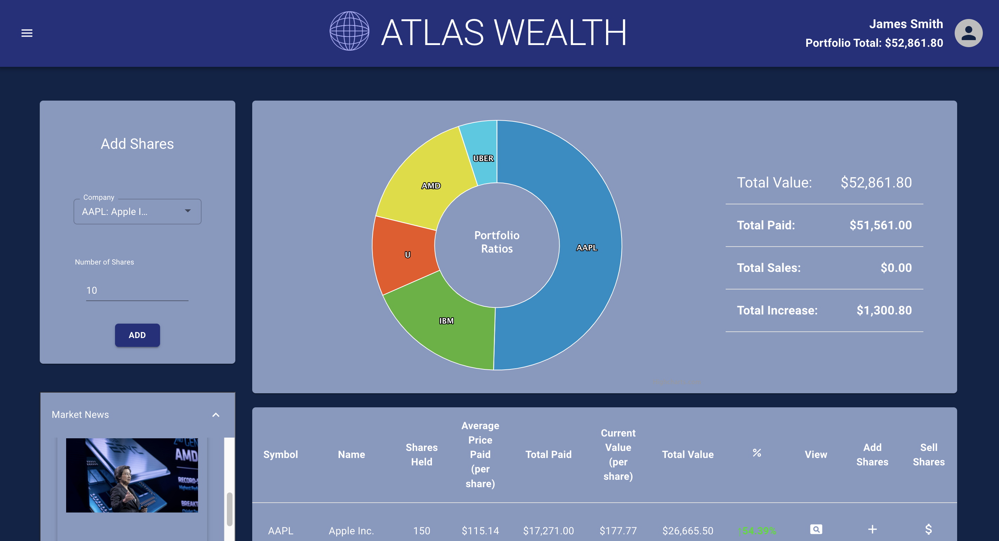
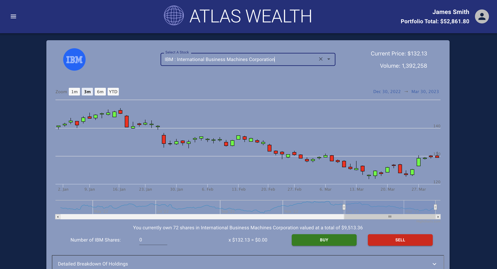

# CodeClan - JavaScript Group Project

<kbd>
 
 </kbd>
 <br></br>

Atlas Wealth is a full-stack web application intended to help the client to record the held shares and track the market value changes.

This project was built using:

- React JS
- Express.js
- MongoDB
- Styled with MaterialUI
- TDD - Mocha | Cypress
- Finnhub API


<hr>

<span>


</span>

<br>
<hr>

### Screenshots

<div align="center">
   <span>
    <kbd>
      
    </kbd>
     &emsp;&emsp;
    <kbd>
     
    </kbd>
     <span>
 </div>

<br>
<hr>

## Brief

A local trader has come to you with a portfolio of shares. She wants to be able to analyse it more effectively. She has a small sample data set to give you and would like you to build a Minimum Viable Product that uses the data to display her portfolio so that she can make better decisions.

### MVP

A user should be able to:

- View total current value.
- View individual and total performance trends.
- Retrieve a list of share prices from an external API and allow the user to add shares to her portfolio.
- Sell individual or multiple shares from her portfolio.
- View a chart of the current values in her portfolio.

### Extensions 

Possible Extensions:

- Be able to view current News relating to a specifc share.
- Setup the application for multiple users to use. 
- Add a watched list for favourite shares.
<br>
<hr>
<br>

## My Experience - -Timo Henderson
<br>

This project was built in a week with a remote team who had never worked together before. We had to quickly establish team roles and find a way to plan and implement this. We found that Chris and Ross seemed to be firing out front end ideas and Neil and I seemed more interested in figuring out which API would be suitable for getting our stock data and agreed to work more on the backend. We decided to work in an agile manner with a kanban board and daily standups, although we met online much more often than that.


We initially worked on some wireframes together to give us an idea of how the app would look and what data would be required. We also settled on using MaterialUI in React for the front end. I was a bit disappointed not to get to delve deeper into that, but someone's got to build the back end.

As we were inevitably going to have to fetch data from an external API that required an API key we realised early on that we would need to fetch from this server-side. This was something I had not done before so it was a good chance to learn about how to hide my key from GitHub scrapers using a gitignored .env file. We initially intended to use AlphaVantage for our stock data, which severely limited the frequency of the api calls that were allowed. To overcome this we designed the backend to cache stock data daily in our MongoDB database and set up a rate limiter to ensure we wouldn't get locked out. 

Ultimately AlphaVantage was too restrictive and the load time when data was not cached made the app infuriating especially when in developmment. We changed our data provider to Finnhub, who gave much higher rate limits and more nicely formatted data. If you are going to build a financial app with no money, I'd highly recommmend Finnhub. This meant that the rate limiter was no longer needed but we kept the caching as we decided daily data was up to date enough for this project. We also limited the number of stocks supported to the top 30 tech stocks. I calculated that to fetch the full list offered would take about 8 hours.

We had some discussion about whether the calculations for the user portfolio values would be done in the client or server-side. We decided that while would take a slight hit to the responsiveness of the front-end, having the calculations done at the back end had the advantage of not having to keep the two in sync. The database remained the single source of truth and meant that single transactions could be what was stored in the user object. When a transaction took place, a POST request was sent from the client with the number of shares, the stock symbol, and the current price to the server. The server then added this to the database, calculated the required updated values and sent this to back to the front end where it could be replaced in state. I felt much more comfortable with this as I've actually lost sleep worrying about mutating state.

As the back end functionality became complete I moved more into the front end and Neil moved into testing. I got a bit of a go of MaterialUI but I would really like to delve deeper. I investigated HighCharts and used this to create the stock chart and Pie chart. I felt best placed to do this as I knew how the data was being formatted from the server and how to alter it if need be. I had an interesting bug here as the AlphaVantage data was backwards so the OHLC data array had to be reversed. Finnhub give you the data the right way round so I only had to remove the reverse function from the data parser to fix it, although this took some time to track down.

At the very end of the project I started getting requests from the frontend guys for company logos and company news. This was relatively easily acheived as we had built the back end to be extensible, following a repository pattern. I just had to set up some new routes and as the repository and fetch function were written fairly generically this didn't require too much tweaking.

One thing I didn't quite get to implement was realtime price tickers using websockets. The external connection had to be done at the server-side. This data was then passed through a websocket server running within the express server to a client component in the react front end. I got this functioning but ran out of time to figure out what to do with the overwhelming streams of data coming in.

Ultimately I think that the project was a success. We surpassed our MVP and completed most of our extensions to this. We worked well as a team, overcame some disagreements and learned a lot about the process of creating a full-stack web app collaboratively. I got the opportunity to draw some confusing looking server diagrams and get the satisfaction of unraveling these into a fairly complex but extensible back end. I think the UI looks fairly consistent and familiar and gives the user easy access to useful information. Overall, I'm proud of what we acheived in a short time and think we produced a solid app.

<br>
<hr>
<br>


## Project Setup

#### Inside Server Folder:

Install required node modules:

```
npm i
```

Run seed file to populate app with template data:

```
npm run seeds
```

Create .env file in the server folder, add the following code and insert the API key from [Finnhub](https://finnhub.io/):
    
    
```
API_KEY="your api key goes here"
```
Start the server:

```
npm run server:dev
```

#### Inside Client Folder:

Install required node modules:

```
npm i
```

Start the app:

```
npm start
```

## Contributors:

<a href="https://github.com/Neil-Burgoyne/Shares-Portfolio-Application/graphs/contributors">
  
</a>

[Tim Henderson](https://github.com/TimoHenderson) | [Chris Barclay](https://github.com/doublerdiner) | [Neil Burgoyne](https://github.com/Neil-Burgoyne) | [Ross Condie](https://github.com/rosscondie)